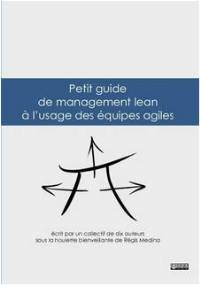
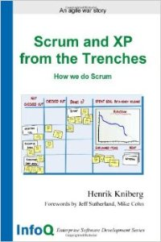
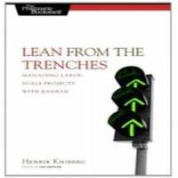
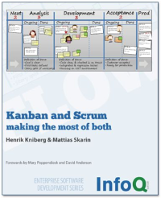
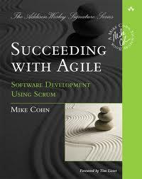

# Références bibliothéquaires

## "Scrum, le guide de la méthode agile la plus populaire" par  Claude Aubry- 4e édition oct. 2015

Une belle façon de découvrir le livre et son auteur : Lire  [la préface de l'édition 4 par Pablo Pernot](http://www.areyouagile.com/2015/10/preface-scrum-4eme-edition/)

 

*4eme de couverture : * "Cet ouvrage s'adresse à tous ceux qui sont impliqués dans le développement logiciel, et qui souhaitent s'initier aux méthodes agiles, qu'ils soient chefs de produit, développeurs ou managers.
Ceux qui ont déjà une première expérience de Scrum y trouveront de quoi approfondir leurs connaissances. Claude Aubry […] montre comment organiser le travail de l'équipe dans un backlog pour produire des versions à chaque sprint en suivant un cérémonial qui a fait la preuve de son efficacité. 
Au-delà de Scrum, ce livre présente les pratiques agiles et donne des pistes pour adapter l’agilité au contexte des organisations. "

**Plus d'informations **
>[Acheter le livre](http://www.amazon.fr/Scrum-guide-pratique-m%C3%A9thode-populaire/dp/2100738747)
>[Le blog  de l'auteur](http://www.aubryconseil.com/)

## "Kanban pour l'IT" par  Laurent Morisseau - 2e édition 
La préface en 6 billets de Claude Aubry : Lire [la préface de la deuxieme édition](http://www.aubryconseil.com/post/Preface-de-Kanban-pour-l-IT-1)

« Une nouvelle méthode pour améliorer les processus de développement » 
Cet ouvrage s’adresse à tous ceux qui s’intéressent au Kanban: Chef de projet, Scrum master, Coach agile, Responsable méthode, Développeur… ou DSI
L’objectif des systèmes kanban, nés dans l’industrie automobile au Japon dans les années 1950, est d’arriver à équilibrer la production à la demande.
Aujourd’hui, l’univers du développement logiciel adapte ces concepts pour ses propres besoins, et l’objectif de ce livre est de vous expliquer comment 

**Plus d'informations **
>[Le blog  de l'auteur](http://www.morisseauconsulting.com/)

## "Spécifiez agile - Expression de besoins : la boîte à outils du product owner" par  Thierry Cros
Lire [la préface de Claude Aubry](http://www.aubryconseil.com/post/Preface-de-Specifiez-agile)

Vous êtes :
- Product owner de Scrum
- Product manager
- Analyste ou Testeur fonctionnel
- Expert métier
- Consultant A-MOA
- Chef de projet utilisateur ou fonctionnel
- Marketeur,

Vous participez à l'expression de besoins.
Ce livre s'adresse à vous. C'est un guide, fruit de 12 ans d'accompagnement d'équipes.
Les Scrum masters et Coaches agiles pourront l'utiliser en tant que ressource support.

**Plus d'informations **
>[Le blog  de l'auteur](http://thierrycros.net)

## "Petit guide de management lean à l'usage des équipes agiles" par un collectif à 10 mains

 

"Ce guide gratuit, rédigé par des praticiens expérimentés, vous aidera à démarrer la mise en oeuvre de trois techniques lean fondamentales pour améliorer vos pratiques agiles :
- Identifier plus finement les développements nécessaires pour résoudre vraiment le problème de vos clients ;
- Créer un environnement visuel qui emmène toute votre équipe dans l'amélioration continue ;
- Trouver les améliorations qui font la différence, par une démarche structurée de résolution des problèmes.

Chaque pratique est illustrée d'exemples concrets, et accompagnée d'une checklist pour démarrer du bon pied.
Alors qu'attendez-vous ? "

**Plus d'informations **
> A télécharger gratuitement sur [le site]( http://www.leanagilecamp.fr/index.html)

## From the Trenches par Henrik Kniberg
 
  

Trois livres pragmatiques pour Scrum masters, chefs de projets, managers... et leurs équipes !
- Scrum & XP : Expliqués par l'exemple (*)
- Kanban / Scrum : Comment tirer le meilleur des deux
- Mieux comprendre le lean par l'exemple

(*) Revu récement par l'auteur et [disponible sur infoQ](http://blog.crisp.se/2015/06/10/henrikkniberg/2nd-edition-of-scrum-xp-from-the-trenches)

**Plus d'informations **
> sur l'[auteur](	http://blog.crisp.se/author/henrikkniberg)

## "Succeeding with agile" par Mike Cohn

> Proven, 100% Practical Guidance for Making Scrum and Agile Work in Any Organization”

 
 

"This is the definitive, realistic, actionable guide to starting fast with Scrum and agile–and then succeeding over the long haul. Leading agile consultant and practitioner Mike Cohn presents detailed recommendations, powerful tips, and real-world case studies drawn from his unparalleled experience helping hundreds of software organizations make Scrum and agile work."

**Sommaire**
- Pour commencer
- Les individus
- Les équipes
- L'organisation
- Les prochaines étapes

**Plus d'informations **
> sur [le livre](http://www.succeedingwithagile.com)
> sur [l'auteur](https://www.mountaingoatsoftware.com/)

