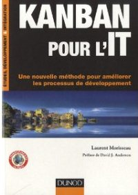

# Références bibliothéquaires

## "Scrum, le guide de la méthode agile la plus populaire" par  ***Claude Aubry ***- 4e édition oct. 2015

Une belle façon de découvrir le livre et son auteur : Lire  [la préface de l'édition 4 par Pablo Pernot](http://www.areyouagile.com/2015/10/preface-scrum-4eme-edition/)

 

*4eme de couverture : * "Cet ouvrage s'adresse à tous ceux qui sont impliqués dans le développement logiciel, et qui souhaitent s'initier aux méthodes agiles, qu'ils soient chefs de produit, développeurs ou managers.
Ceux qui ont déjà une première expérience de Scrum y trouveront de quoi approfondir leurs connaissances. Claude Aubry […] montre comment organiser le travail de l'équipe dans un backlog pour produire des versions à chaque sprint en suivant un cérémonial qui a fait la preuve de son efficacité. 
Au-delà de Scrum, ce livre présente les pratiques agiles et donne des pistes pour adapter l’agilité au contexte des organisations. "

>[Acheter le livre](http://www.amazon.fr/Scrum-guide-pratique-m%C3%A9thode-populaire/dp/2100738747)
[Le blog  de l'auteur](http://www.aubryconseil.com/)

## "Kanban pour l'IT" par  ***Laurent Morisseau ***- 2e édition 
La préface en 6 billets de Claude Aubry : Lire [la préface de la deuxieme édition](http://www.aubryconseil.com/post/Preface-de-Kanban-pour-l-IT-1)

« Une nouvelle méthode pour améliorer les processus de développement » 
Cet ouvrage s’adresse à tous ceux qui s’intéressent au Kanban: Chef de projet, Scrum master, Coach agile, Responsable méthode, Développeur… ou DSI
L’objectif des systèmes kanban, nés dans l’industrie automobile au Japon dans les années 1950, est d’arriver à équilibrer la production à la demande.
Aujourd’hui, l’univers du développement logiciel adapte ces concepts pour ses propres besoins, et l’objectif de ce livre est de vous expliquer comment 

[Le blog  de l'auteur](http://www.morisseauconsulting.com/)

## "Spécifiez agile - Expression de besoins : la boîte à outils du product owner" par  Thierry Cros
Lire [la préface de Claude Aubry](http://www.aubryconseil.com/post/Preface-de-Specifiez-agile)

Vous êtes :
- Product owner de Scrum
- Product manager
- Analyste ou Testeur fonctionnel
- Expert métier
- Consultant A-MOA
- Chef de projet utilisateur ou fonctionnel
- Marketeur,

Vous participez à l'expression de besoins.
Ce livre s'adresse à vous. C'est un guide, fruit de 12 ans d'accompagnement d'équipes.
Les Scrum masters et Coaches agiles pourront l'utiliser en tant que ressource support.

[Le blog  de l'auteur](http://thierrycros.net)
