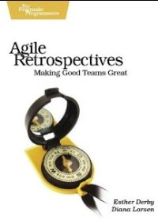
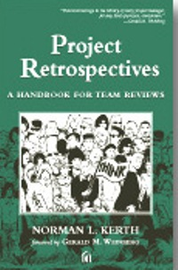
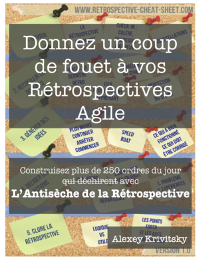

# La rétropsective

>Apprendre de ses erreurs pour ne pas les répeter.

## Objectifs
- REVELER L'HISTOIRE : Apprécier le résultat, Mesurer l'effort fournit
- IDENTIFIER les problèmes et proposer des solutions
- COMPRENDRE et enlever les obstacles
- EQUIPE : créer un esprit de groupe, améliorer l'ambiance de travail, augmenter la confiance entre les participants, libérer la parole, réparer les dégâts
- Faire ressortir la sagesse collective	
- Rester vigilant, Capitaliser
- Faire du brainstorming de groupe
- ENCOURAGER le changement
- AMELIORER le process, les procédures, le management, la culture

## Définitons
> AMELIORATION CONTINUE : Activité régulière permettant d’accroître la capacité à satisfaire aux exigences
- - -
>MANIFESTE Agile : A intervalles réguliers, l’équipe réfléchit  à comment devenir plus efficace, puis adapte et ajuste son comportement en conséquence
- - -
>RETROSPECTIVE : une cérémonie qui a lieu à la fin d'une itération/version/projet pour apprendre à partir des retours d'expérience et pour planifier les changements dans la phase d'effort suivante.

## KAIZEN : Le «Changement – Bon » en 10 points
1. Abandonner les idées fixes, refuser l'état actuel des choses
2. Au lieu d'expliquer ce que l'on ne peut pas faire, réfléchir comment faire
3. Réaliser aussitôt les bonnes propositions d'amélioration
4. Ne pas chercher la perfection, gagner 60% maintenant
5. Corriger l'erreur immédiatement sur place
6. Trouver des idées dans la difficulté
7. Chercher la cause réelle, respecter les « 5 pourquoi ? » et chercher ensuite la solution
8. Prendre en compte les idées de 10 personnes au lieu d'attendre l'idée géniale d'une seule
9. Essayer et ensuite valider
10. L'amélioration est infinie

## DEROULEMENT 
    0 – PREPARATION (1H)
- Synthétiser les informations produites par le management visuel
- Relever les points les plus motivants
- Réfléchir comment obtenir les meilleurs retours  

    I – PLANTER LE DECOR (5-10')
- Mettre les participants en situation de S'EXPRIMER librement et en CONFIANCE
- Réveiller leurs aptitudes CREATIVES
- Définir ou rappeler le PROTOCOLE de la réunion (Concision, Respect, Ecoute, Participation)
- PRIME DIRECTIVE d'une rétrospective 
> « Peu importe ce que l'on va découvrir, chacun comprend et accepte que tout le monde a fait de son mieux par rapport à sa connaissance, ses compétences et la situation du moment »	

	II – COLLECTER LES INFORMATIONS (40-60’)
- Autour de différents ateliers, collecter les points de vue, les impressions des membres de l'équipe
- Veiller a ce que chacun prenne la parole
- Faire émerger les points sur lesquels on va travailler par la suite  

    III – PRODUIRE LES IDEES (20-30')
- Autour de différents ateliers, réfléchir sur les points ressortis lors de l'étape précédente afin de :
  + Améliorer ce qui PEUT et DOIT l'être
  + Arrêter de faire ce qui est du gaspillage
  + Continuer de faire ce qui favorise la création de valeur
- Veiller à maintenir un haut niveau de créativité  

	IV – DECIDER LES ACTIONS (15-20’)
- Sélectionner les actions les plus prioritaires dans le contexte du projet
- Faciliter la prise en charge des actions par une personne volontaire
- Veiller à faire le bilan des actions précédentes
- Veiller à planifier du temps pour la réalisation de ses actions  

	V – CLOTURER LA RETROSPECTIVE (5-10’)
- Rebondir pour la suite 
- Evaluer la qualité de la rétrospective

## Retours d'expérience
### A Essayer
- Varier le déroulement des rétrospectives
- Continuer à faire des rétrospectives
- 1h par semaine d’itération
- Parler de ce qui va bien
- Pousser les rétrospectives en fin de version 

###  A Eviter
- Vouloir tout améliorer
- Les actions décidées ne sont pas réalisées sur l'itération
- Peu d'informations sont collectées
- Une ou plusieurs personnes ne parlent pas 

## Citations
>« Celui qui ne se souvient pas de l'Histoire est condamné à la répéter.» George SANTAYANA  
« Ce n'est pas parce que les choses sont difficiles que nous n'osons pas, c'est parce que nous n'osons pas qu'elles sont difficiles. » SENEQUE  
« La vie est un cimetière de lucidités rétrospectives. » Jean-François REVEL  
« Tant que ce qui est appris n'est pas appliqué, il n'y a pas d'apprentissage. » Dave MEIER  
« On peut faire des rétrospectives sans être Agile, mais on ne peut pas être Agile sans faire de rétrospectives » Jean-Claude MERIGNAC  

## Références 
[Livre] [Agile Retrospective : Making Good Teams Great](http://www.amazon.fr/Agile-Retrospectives-Making-Teams-Great/dp/0977616649)  
  
Esther DERBY, Diana LARSEN et Ken SCHWABER (The Pragmatic Programmers)

[Livre][ Project Retrospectives : A handbook for Team Reviews](http://www.amazon.fr/Project-Retrospectives-Handbook-Team-Reviews/dp/0932633447)  
  
Norman L. KERTH

[Livre] [Donnez un coup de fouet à vos Rétrospectives Agile](https://leanpub.com/agile-retrospective-kickstarter-fr)  
  
> Construisez plus de 250 ordres du jour qui déchirent avec L'Antisèche de la Rétrospective. 

Alexey KRIVITSKY
- - -
[Article] Jean-Claude MERIGNAC : L'Art de la Rétrospective ([première partie](http://goo.gl/MKVgr))  
[Article] Jean-Claude GROSJEAN : [Des chapeaux pour ma rétro](http://goo.gl/W1vBn)  
[Article] Jean-Claude GROSJEAN : [La fleur de Lotus](http://goo.gl/Zhij1)  
[Article] Yves HANOULLE : [Work Retrospective](http://goo.gl/48Q0i) [EN]  
[Article] Yves HANOULLE : [Improve the Demo](http://goo.gl/j29C2) [EN]  

